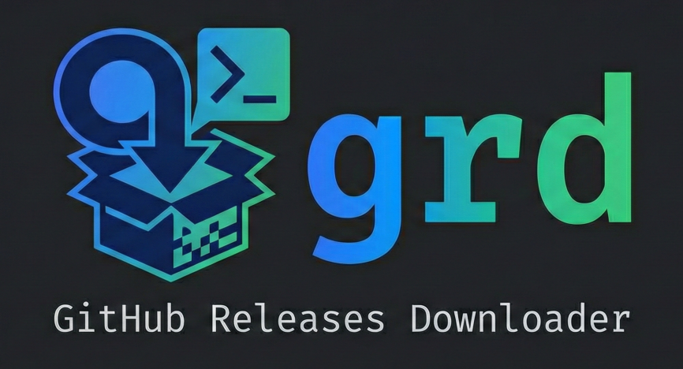

GitHub Release Downloader

A command-line tool to download and install binaries from GitHub releases.

## Installation

### From crates.io

If published on crates.io:

```bash
cargo install grd
```

### From source

Ensure you have Rust installed, then:

```bash
cargo install --path .
```

### Prebuilt binaries

Download from [releases](https://github.com/lucidfrontier45/grd/releases).

## Usage

Download the latest release of a repository:

```bash
grd owner/repo
```

Download a specific version:

```bash
grd owner/repo --tag v1.0.0
```

List available versions:

```bash
grd owner/repo --list
```

Specify destination directory:

```bash
grd owner/repo --destination /usr/local/bin
```

Set a custom memory limit (e.g., 50MB):

```bash
grd owner/repo --memory-limit 52428800
```


Download for a specific platform (explicit OS/arch):

```bash
grd owner/repo --os linux --arch aarch64 # arm64 is also accepted
grd owner/repo --os windows --arch x86_64 # amd64 and x64 are also accepted
```

Download without decompressing/extracting:

```bash
grd owner/repo --no-decompress
```


## Memory Usage

- Downloads smaller than the memory limit are loaded entirely into RAM for processing.
- Larger downloads use temporary files to avoid excessive memory consumption.
- The default limit is 100MB, but can be adjusted with `--memory-limit`.

## Options

- `repo`: GitHub repository (owner/repo)
- `--tag`: Specific version tag (defaults to latest)
- `--list`: List available releases
- `--destination`: Destination directory (default: current directory)
- `--bin-name`: Override executable name
- `--first`: Select first matching asset without prompting
- `--exclude`: Comma-separated words to exclude from asset matching
- `--no-decompress`: Save downloaded file without decompressing/extracting it
- `--memory-limit`: Memory limit in bytes; downloads larger than this use temp files (default: 104857600, i.e., 100MB)
- `--os`: Target OS (windows, macos, linux). Defaults to auto-detection.
- `--arch`: Target architecture (x86_64, aarch64, amd64, x64, arm64). Defaults to auto-detection. Aliases: amd64 and x64 → x86_64; arm64 → aarch64.

## Building

```bash
cargo clippy
cargo test
cargo build --release
```
