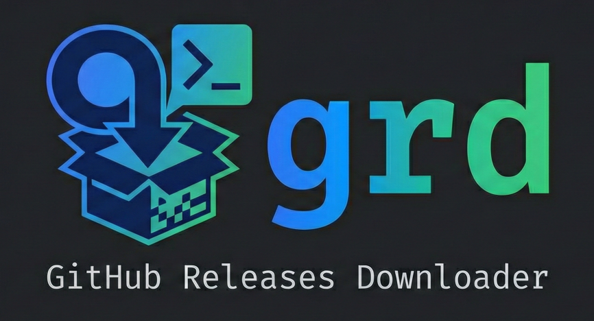

GitHub Release Downloader

A command-line tool to download and install binaries from GitHub releases.

## Installation

### From crates.io

If published on crates.io:

```bash
cargo install grd
```

### From source

Ensure you have Rust installed, then:

```bash
cargo install --path .
```

### Prebuilt binaries

Download from [releases](https://github.com/lucidfrontier45/grd/releases).

### Docker

Use `grd` inside another Docker container.

```Dockerfile
COPY --from=ghcr.io/lucidfrontier45/grd:latest /bin/grd /bin/grd
```

## Usage

Download the latest release of a repository:

### Authentication

To avoid GitHub API rate limits (60 requests/hour unauthenticated vs 5000/hour authenticated), you can configure a GitHub Personal Access Token (PAT):

**Using environment variables:**

```bash
export GITHUB_PAT=your_token_here
# or
export GITHUB_TOKEN=your_token_here
```

**Using a .env file:**

Create a `.env` file in your working directory:

```bash
GITHUB_PAT=your_token_here
```

The `GITHUB_PAT` variable takes precedence over `GITHUB_TOKEN`.

## Subcommands

### `register`

Set a default install directory for future downloads (persisted in state cache):

```bash
grd register /usr/local/bin
```

### `info`

Show detailed information about an installed package (from cache):

```bash
grd info owner/repo
```

Output format is machine-parseable key=value pairs separated by semicolons:
```
repo=owner/repo;tag=v1.0.0;asset=app-linux-x86_64.tar.gz;destination=/usr/local/bin;binary=/usr/local/bin/app;binary_exists=true
```

### `remove`

Remove an installed package and its state cache entry:

```bash
grd remove owner/repo
```

### `list-installed`

List all previously installed packages (from cache):

```bash
grd list-installed
```

### `list-platform`

List supported platform targets (OS/arch combinations):

```bash
grd list-platform
```

## Basic Commands

Download the latest release of a repository:

```bash
grd owner/repo
```

Download a specific version:

```bash
grd owner/repo --tag v1.0.0
```

List available versions:

```bash
grd owner/repo --list
```

List all previously installed packages (from cache):

```bash
grd list-installed
```

List supported platform targets:

```bash
grd list-platform
```

Specify destination directory:

```bash
grd owner/repo --destination /usr/local/bin
```

Set a custom memory limit (e.g., 50MB):

```bash
grd owner/repo --memory-limit 52428800
```


Download for a specific platform (explicit OS/arch):

```bash
grd owner/repo --os linux --arch aarch64 # arm64 is also accepted
grd owner/repo --os windows --arch x86_64 # amd64 and x64 are also accepted
```

Download without decompressing/extracting:

```bash
grd owner/repo --no-decompress
```


## Memory Usage

- Downloads smaller than the memory limit are loaded entirely into RAM for processing.
- Larger downloads use temporary files to avoid excessive memory consumption.
- The default limit is 100MB, but can be adjusted with `--memory-limit`.

## Version Cache

To avoid redundant downloads, `grd` caches the last-downloaded release version per
repository in `~/.grd/state.toml`:

- **When checked**: On every run *without* `--tag` or `--force`.
- **Conditions for a hit**: The target binary already exists on disk **and** the
  cached release tag **and** asset name both match the latest release from GitHub.
- **On hit**: Prints `Already at <asset> version <tag>` and exits without downloading.
- **On miss or not checked**: Proceeds to download, then updates the cache.
- **Bypass**: Use `--force` to skip the cache and force a fresh download.
- **Fault-tolerant**: A missing, corrupt, or unwritable cache file never blocks the
  download — warnings are printed to stderr and execution continues.
- **Format**: TOML keyed by `"owner/repo"`:
  ```toml
  [versions]
  "owner/repo" = { tag = "v1.0.0", asset = "app-linux-x86_64.tar.gz", destination = "/usr/local/bin" }
  ```
  - `destination` is mandatory and records where the binary was installed.
  - An optional `default_install_dir` at the top level may be set via `grd register <path>`. When `--destination` is not passed, newly downloaded releases use this path.

## Options

- `repo`: GitHub repository (owner/repo)
- `--tag`: Specific version tag (defaults to latest)
- `list-installed`: List all previously downloaded releases from the local cache
- `list-platform`: Display supported OS/architecture combinations
- `--list`: List available releases
- `--destination`: Destination directory (default: current directory)
- `--bin-name`: Override executable name
- `--select`: Force manual selection from all available assets
- `--exclude`: Comma-separated words to exclude from asset matching
- `--no-decompress`: Save downloaded file without decompressing/extracting it
- `--memory-limit`: Memory limit in bytes; downloads larger than this use temp files (default: 104857600, i.e., 100MB)
- `--force`: Skip the version cache check and force a fresh download.
- `-y / --yes`: Skip the upgrade confirmation prompt.
- `--os`: Target OS (windows, macos, linux). Defaults to auto-detection.
- `--arch`: Target architecture (x86_64, aarch64, amd64, x64, arm64). Defaults to auto-detection. Aliases: amd64 and x64 → x86_64; arm64 → aarch64.

## Building

```bash
cargo clippy
cargo test
cargo build --release
```

## Git hooks

Set up a local git hook to run checks automatically using `pre-commit`.

- Install `pre-commit` (recommended: `pip`; or use `uv` if you manage tools that way):

```bash
# with pip (user install)
pip install --user pre-commit

# with uv (if you use `uv` to manage tools)
uv tool install pre-commit
```

- Install the git hook into this repository (generates the hook script under `.git/hooks`):

```bash
pre-commit install
```

- (Optional) Run all configured hooks once across the repo:

```bash
pre-commit run --all-files
```

This ensures linters and formatters configured in `.pre-commit-config.yaml` run automatically on commit.
